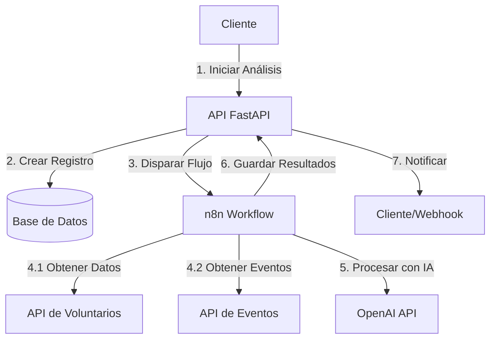
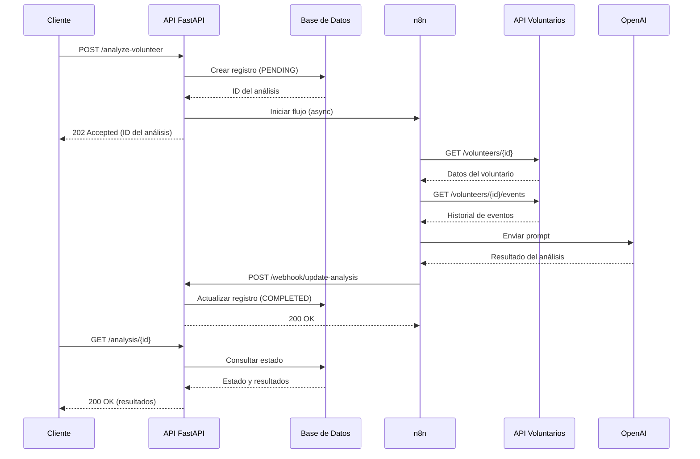

# Flujo de Trabajo del Agente Autónomo de Análisis de Voluntarios

## Índice
1. [Introducción](#introducción)
2. [Arquitectura General](#arquitectura-general)
3. [Flujo Detallado](#flujo-detallado)
   - [1. Inicio del Análisis](#1-inicio-del-análisis)
   - [2. Procesamiento en n8n](#2-procesamiento-en-n8n)
   - [3. Análisis con IA](#3-análisis-con-ia)
   - [4. Almacenamiento de Resultados](#4-almacenamiento-de-resultados)
   - [5. Consulta de Resultados](#5-consulta-de-resultados)
4. [Diagrama de Secuencia](#diagrama-de-secuencia)
5. [Manejo de Errores](#manejo-de-errores)
6. [Seguridad](#seguridad)
7. [Monitoreo y Registros](#monitoreo-y-registros)

## Introducción

El Agente Autónomo de Análisis de Voluntarios es un módulo que utiliza inteligencia artificial para analizar el perfil de los voluntarios y generar recomendaciones personalizadas. Este documento describe en detalle cómo funciona el flujo de trabajo completo del agente.

## Arquitectura General



## Flujo Detallado

### 1. Inicio del Análisis

**Endpoint**: `POST /api/v1/agent/analyze-volunteer`

**Entrada**:
```json
{
  "voluntario_id": 1,
  "incluir_historico": true,
  "incluir_recomendaciones": true,
  "idioma": "es"
}
```

**Proceso**:
1. Validar autenticación (JWT)
2. Validar datos de entrada
3. Crear registro en la base de datos con estado `PENDING`
4. Iniciar flujo de trabajo en n8n de forma asíncrona
5. Retornar ID del análisis

**Salida (202 Accepted)**:
```json
{
  "analysis_id": 42,
  "status": "pending",
  "message": "Análisis iniciado correctamente",
  "links": [
    {
      "rel": "status",
      "href": "/api/v1/agent/analysis/42",
      "method": "GET"
    }
  ]
}
```

### 2. Procesamiento en n8n

**Nodos del Flujo**:

1. **Webhook de Entrada**
   - Recibe la solicitud de análisis
   - Extrae `voluntario_id` y parámetros

2. **Crear Registro en BD**
   - Actualiza el estado del análisis a `PROCESSING`
   - Registra la hora de inicio

3. **Obtener Datos del Voluntario**
   - Realiza una petición GET a `/api/v1/volunteers/{id}`
   - Recoge información personal, habilidades, experiencia

4. **Obtener Historial de Eventos**
   - Realiza una petición GET a `/api/v1/volunteers/{id}/events`
   - Obtiene lista de eventos previos, asistencia y valoraciones

### 3. Análisis con IA

**Proceso en OpenAI**:
1. Se construye un prompt estructurado con:
   - Datos personales del voluntario
   - Historial de participación en eventos
   - Habilidades y experiencia
   - Parámetros del análisis (idioma, profundidad, etc.)

2. Se envía a la API de OpenAI (GPT-4) con instrucciones para:
   - Analizar fortalezas y áreas de mejora
   - Generar recomendaciones personalizadas
   - Proporcionar un resumen ejecutivo
   - Sugerir tipos de eventos adecuados

**Ejemplo de Prompt**:
```
Analiza el perfil del siguiente voluntario y genera un informe detallado:

Datos del voluntario:
- Nombre: [Nombre]
- Edad: [Edad]
- Habilidades: [Lista de habilidades]
- Experiencia: [Años de experiencia]

Historial de eventos:
- [Evento 1]: [Rol] - [Valoración]
- [Evento 2]: [Rol] - [Valoración]

Por favor, genera un informe que incluya:
1. Resumen ejecutivo
2. Fortalezas identificadas
3. Áreas de mejora
4. Recomendaciones para futuros eventos
5. Compatibilidad con diferentes tipos de eventos

Idioma: [es]
```

### 4. Almacenamiento de Resultados

1. **Procesamiento de la Respuesta de OpenAI**:
   - Se parsea la respuesta JSON
   - Se extraen las secciones relevantes
   - Se formatean los datos para almacenamiento

2. **Actualización en Base de Datos**:
   - Se actualiza el registro del análisis
   - Se guardan los resultados estructurados
   - Se actualiza el estado a `COMPLETED`
   - Se registra la hora de finalización

**Estructura de Resultados**:
```json
{
  "resumen": "...",
  "puntos_fuertes": ["...", "..."],
  "areas_mejora": ["...", "..."],
  "recomendaciones": ["...", "..."],
  "compatibilidad_eventos": {
    "tipo_evento_1": 85,
    "tipo_evento_2": 72
  },
  "metadatos": {
    "modelo": "gpt-4-turbo",
    "tokens_usados": 1245,
    "tiempo_procesamiento": 12.8
  }
}
```

### 5. Consulta de Resultados

**Endpoint**: `GET /api/v1/agent/analysis/{analysis_id}`

**Respuesta Exitosa (200 OK)**:
```json
{
  "analysis_id": 42,
  "voluntario_id": 1,
  "estado": "completed",
  "fecha_creacion": "2023-07-29T15:30:00Z",
  "fecha_actualizacion": "2023-07-29T15:32:15Z",
  "resultado": {
    "resumen": "...",
    "puntos_fuertes": ["...", "..."],
    "areas_mejora": ["...", "..."],
    "recomendaciones": ["...", "..."]
  },
  "metadatos": {
    "modelo": "gpt-4-turbo",
    "tokens_usados": 1245,
    "tiempo_procesamiento": 12.8
  }
}
```

## Diagrama de Secuencia



## Manejo de Errores

### Códigos de Error Comunes

| Código | Error | Causa Probable | Solución |
|--------|-------|----------------|-----------|
| 400 | Bad Request | Datos de entrada inválidos | Verificar el formato de la solicitud |
| 401 | Unauthorized | Token JWT inválido o expirado | Renovar el token de autenticación |
| 403 | Forbidden | Permisos insuficientes | Verificar roles del usuario |
| 404 | Not Found | Recurso no encontrado | Verificar IDs en la URL |
| 422 | Unprocessable Entity | Validación fallida | Revisar mensajes de error |
| 500 | Internal Server Error | Error en el servidor | Revisar logs del servidor |
| 502 | Bad Gateway | Error en comunicación con servicios externos | Verificar estado de n8n/OpenAI |
| 504 | Gateway Timeout | Tiempo de espera agotado | Reintentar la operación |

### Reintentos Automáticos

- Se implementan 3 reintentos para llamadas a APIs externas
- Backoff exponencial entre reintentos (1s, 2s, 4s)
- Se registran los reintentos fallidos

## Seguridad

### Autenticación
- Todos los endpoints requieren autenticación JWT
- Tokens con expiración configurable
- Renovación automática de tokens

### Autorización
- Control de acceso basado en roles (RBAC)
- Validación de permisos por recurso
- Registro de acciones de auditoría

### Protección de Datos
- Encriptación en tránsito (HTTPS)
- Encriptación en reposo para datos sensibles
- Mascarado de información sensible en logs

## Monitoreo y Registros

### Métricas Clave
- Tiempo promedio de análisis
- Tasa de éxito/error
- Uso de tokens de OpenAI
- Tiempos de respuesta de APIs

### Alertas
- Errores en el flujo de análisis
- Tiempos de respuesta elevados
- Cuota de API de OpenAI cercana al límite
- Errores de conectividad entre servicios

### Logs Estructurados
- Registro de todas las operaciones
- Niveles de severidad (DEBUG, INFO, WARN, ERROR)
- Identificadores de correlación para seguimiento

---

*Última actualización: 29 de Julio de 2023*
